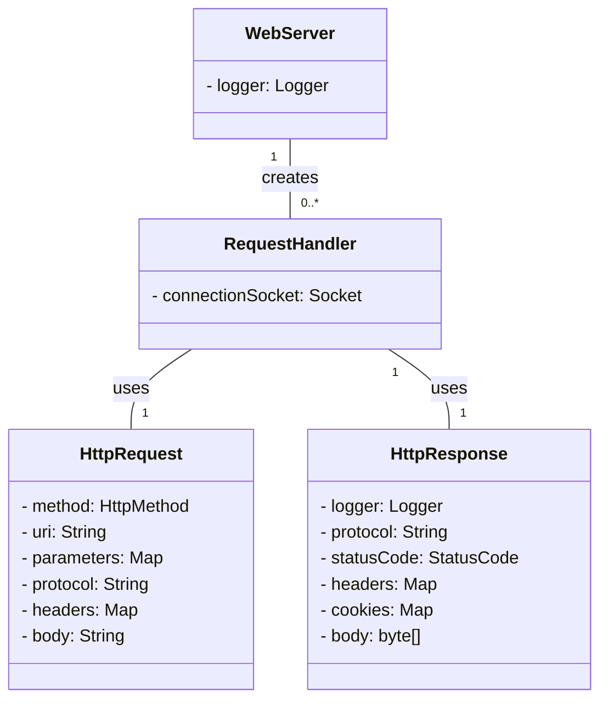
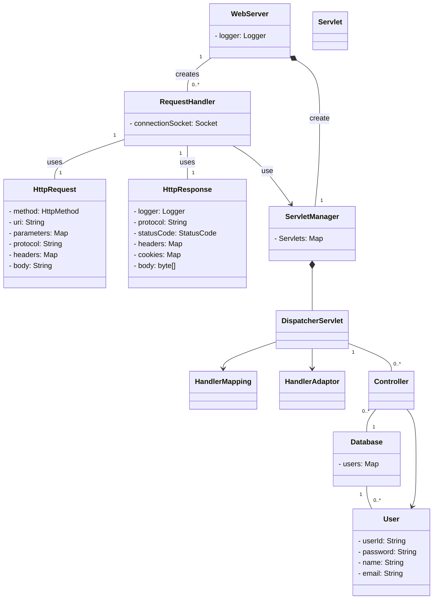

# be-was-2025
코드스쿼드 백엔드 교육용 WAS 2025 개정판

# 학습 기록
[level 1](https://github.com/softeer5th/backend-page/wiki/%ED%95%9C%EC%A4%80%ED%98%B8_week1_day1)

[level 2, 3](https://github.com/softeer5th/backend-page/wiki/%ED%95%9C%EC%A4%80%ED%98%B8_week1_day2)

# Level 1, 2

## 학습해야 하는 내용
- LogBack
- HTTP 파싱

## 구현해야 하는 것
- HTTP 파싱
- ExecutorService 사용하도록 변경

## 도메인 모델 - Level 1, 2

# Level 3

## 현재 문제점

- HTTP Request Line 의 URI 와 정적 폴더 구조가 강결합되어있다.
    - GRASP의 컨트롤러 패턴을 통해 적절한 URI 를 탐색해서 반환하는 구조가 필요하다.
    - HTTP 메시지와 리소스 간 느슨한 결합을 만들어야 한다.
- 하지만 정적 리소스도 서빙해야 한다.
    - CSS, svg파일과 같은 리소스도 서빙할 수 있어야 한다.
- 우선순위를 설정해야 한다.
    1. 동적 리소스
    2. 정적 리소스
    3. 404 Not Found

## 도메인 모델 - level 3

## 개선해야 할 점

- [x] 서블릿들에 발생한 수많은 중복 코드들을 제거해야 함
  - 가짜 중복으로 봐야 함
- [ ] 쿼리 파라미터나 헤더가 여러개 있을 경우의 처리가 필요할듯.
- [x] read 시 파일의 끝에 도달했는지 확인하면서 읽어야 할듯
  - 버퍼 공간이 모잘라서 중간에 끊길수도
- [x] Http 메시지의 헤더는 대소문자를 가리지 않는다. 해당 부분 처리 필요.
- [x] WebServer 의 Main 메소드가 지나치게 무거운 문제
- [ ] 테스트 커버리지가 낮음
- [x] 현재 Servlet 클래스가 지나치게 많아 패키지 구조 이해에 어려움을 주는 중
  - ContentType Enum 처럼, 리플렉션을 이용해 루프를 돌면서 URL을 매핑하는건 어떨까?

# Level 4
## 현재 문제점
- [x] 현재 Servlet 클래스가 지나치게 많아 패키지 구조 이해에 어려움을 주는 중
  - ContentType Enum 처럼, 리플렉션을 이용해 루프를 돌면서 URL을 매핑하는건 어떨까?
- [x] 추후에 게시판을 만들텐데, 게시글의 id를 구분하려면 Path Variable이 필요할텐데, 우아하게 처리하는 방법 없을까?
- [x] Http 메시지의 헤더는 대소문자를 가리지 않는다. 해당 부분 처리 필요.
- [ ] 쿼리 파라미터나 헤더가 여러개 있을 경우의 처리가 필요할듯.
- [ ] 테스트 커버리지가 낮음

## 도메인 모델 - level 4

## 남은 문제점
- [ ] setBody로 한글이 작성되지 않는 문제 - UTF-8, ISO 관련 인코딩 문제일수도
    - Content-Type: text/html; charset=utf-8 로 해결
- [x] Create 서블릿"Location" 문자열 하드코딩되어있음
- [x] Header ": " 공백 지우기
- [x] uri 보단 path 라는 변수명을 사용하는게 좋아보임
- 너무 늦었다. 테스트 코드 작성한 뒤 리팩토링에 대한 두려움 제거되면 시도
- [x] Request 요청 시 BufferedReader 사용하면 안됨
- 문자열 기반이라
- byte[] 이진 데이터 받을 땐 Reader Writer 사용 불가
- [ ] 예외 처리의 혼재
- 동적 리소스 서빙 예외 처리
- 정적 리소스 서빙 예외 처리
- HTTP 메시지 파싱 예외 처리
- [ ] 에러 페이지를 파일로 만들어서 그냥 파일로 찾아서 서빙하는게 좋을듯
- [ ] 리소스 생성 시 반복해서 등장하는 파일 입력 받은 후 Response에 기록하는 코드를 제거할 방법
- [ ] 스프링과 아키텍처가 지나치게 유사한 문제 해결
- [ ] Ambiguous Mapping 검증
-  /test/{id} 와 /test/hello 는 충돌해야 함
- plain 도 렌더링이 되는 이유?
