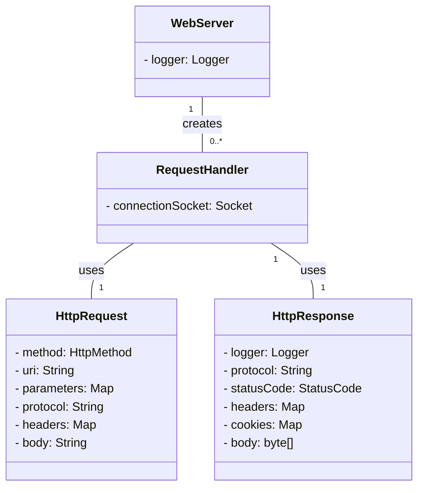
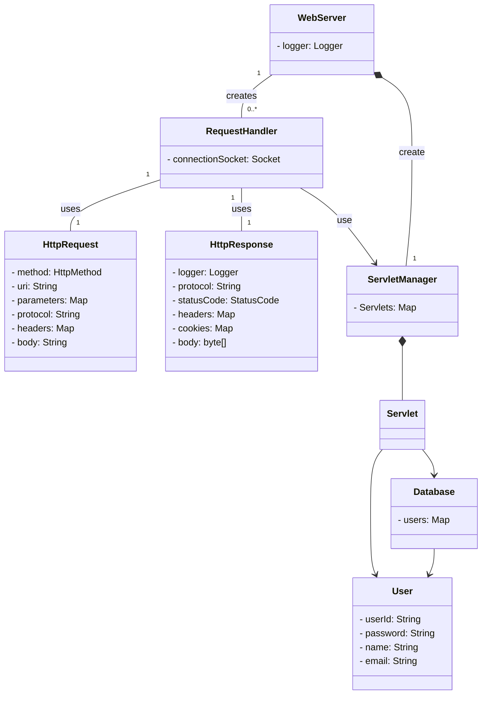

# be-was-2025
코드스쿼드 백엔드 교육용 WAS 2025 개정판

# 학습 기록
[level 1](https://github.com/softeer5th/backend-page/wiki/%ED%95%9C%EC%A4%80%ED%98%B8_week1_day1)

[level 2, 3](https://github.com/softeer5th/backend-page/wiki/%ED%95%9C%EC%A4%80%ED%98%B8_week1_day2)

# Level 1, 2

## 학습해야 하는 내용
- LogBack
- HTTP 파싱

## 구현해야 하는 것
- HTTP 파싱
- ExecutorService 사용하도록 변경

## 도메인 모델 - Level 1, 2

# Level 3

## 현재 문제점

- HTTP Request Line 의 URI 와 정적 폴더 구조가 강결합되어있다.
    - GRASP의 컨트롤러 패턴을 통해 적절한 URI 를 탐색해서 반환하는 구조가 필요하다.
    - HTTP 메시지와 리소스 간 느슨한 결합을 만들어야 한다.
- 하지만 정적 리소스도 서빙해야 한다.
    - CSS, svg파일과 같은 리소스도 서빙할 수 있어야 한다.
- 우선순위를 설정해야 한다.
    1. 동적 리소스
    2. 정적 리소스
    3. 404 Not Found

## 도메인 모델 - level 3
