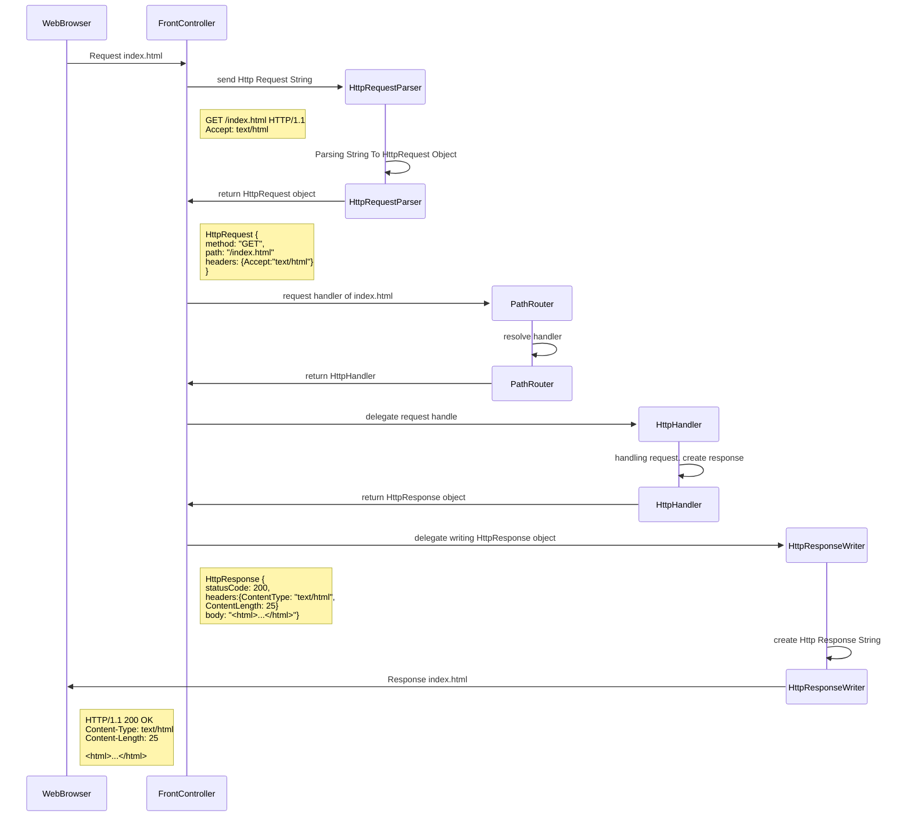

# **학습한 내용**

# 웹서버 1단계

## **1. Thread**

---

| **이름**              | **관리자** | **메모리** | **생성 비용** | **Context Switching** |
|---------------------|---------|---------|-----------|-----------------------|
| **Kernel Thread**   | OS      | 약 1MB   | 높음        | 느림                    |
| **Platform Thread** | JVM     | 약 512KB | 중간        | 중간                    |
| **Virtual Thread**  | JVM     | 약 1KB   | 낮음        | 빠름                    |

---

- **Java 20 이전: Platform Thread**

Kernel Thread 와 1:1 매핑

Context Switching 비용으로 인한 성능 저하 → **C10K Problem**

대안: Reactive Programming → 러닝커브 높음.

---

- **Java 21 이후: Virtual Thread**

Platform Thread 와 1:N 매핑

Virtual Thread를 실행시키는 Platform Thread를 Carrier Thread라고 부름

경량화 되었고 기존 Thread와도 호환 → 추가 기술 없이 적용 가능

**synchronized** 키워드 사용 시 **Carrier Thread를 점유하는 Pinning** 문제가 발생 → ReentrantLock 사용

Thread Pool 없이 사용 권장

## 2. java.utill.concurrent

동시성 제어를 위한 라이브러리 패키지

- **ExecutorService**

일종의 Thread Pool. Executors 클래스를 통해 생성. Runnable 객체를 실행 가능

내부적으로 Thread를 재사용

- **Future**

비동기 작업의 결과값. get() 메서드로 결과값을 기다렸다(Blocking) 얻을 수 있음

- **CountDownLatch**

여러 Thread 가 작업을 동시에 시작하도록 하는 동기화 클래스

- **CyclicBarrier**

CountDownLatch 와 유사하지만 재사용 가능

- **Semaphore**

동시에 실행 가능한 Thread 의 수를 제한하는 동기화 클래스

- **Lock**

동시에 실행 가능한 Thread 의 수를 1개로 제한하는 동기화 클래스

## 3. HTTP 구조

- HTTP Request

```
POST /users HTTP/1.1
Host: example.com
Connection: keep-alive
Content-Type: application/json
Cotnent-Length: 42
Accept: */*

{
	"id": "id1",
	"password": "password1"
}
```

- HTTP Response

```
HTTP/1.1 201 Created
Content-Type: application/json
Content-Length: 154
Location: http://example.com/users/123

{
  "message": "New user created",
  "user": {
    "id": 123,
    "firstName": "Example",
    "lastName": "Person",
    "email": "bsmth@example.com"
  }
}
```

---

**Code Structure**

```java
public class FrontController implements Runnable {
    public void run() {
	  ...
        // create reader using connection
        BufferedReader reader = ...
        // request string parsing
        HttpRequest request = requestParser.parse(reader);
        // resolve handler
        HttpHandler handler = router.route(request.getRequestTarget().getPath()).handler();
        // delegate to handler
        HttpResponse response = handler.handle(request);
        // send response to connection
        responseWriter.writeResponse(request, response, out);
    }
}
```

```java
public interface HttpHandler {
    HttpResponse handle(HttpRequest request);
}
```

```java
public class HttpRequestParser {
    public HttpRequest parse(BufferedReader requestInputReader) {...}
}
```

```java
public class HttpResponseWriter {
    public void writeResponse(HttpRequest request, HttpResponse response, OutputStream out) {...}
}
```

```java
public class PathRouter {
    public PathRuter setDefaultHandler(HttpHadler handler) {...}

    public PathRuter setHandler(String path, HttpHadler handler) {...}

    public RoutingResult route(String path) {...}
}
```

```java
public record RoutingResult(HttpHandler handler, Map<String, String> pathVariable) {
}
```



---

PathRouter

- Request Path와 HttpHandler를 매핑시키는 객체
- Version 1
    - Map<String,HttpHandler> mapping 이용
        - Setting Handler
            - path 를 key, handler 를 value 로 mapping에 저장
        - Routing Handler
            - candidatePaths: path의 last segment를 순차적으로 제거하여 나열한 리스트
                - EX) path = “/a/b/c" → candidatePaths = ["/a/b/c", “/a/b", “/a"]
            - candidiatePaths를 순회하면 handlerMappding 에서 handler를 찾는다
                - 특정 경로에 대해 중복되는 핸들러가 있다면 가장 자세한 핸들러가 우선순위가 높다
                    - EX) mapping = {"/a/b": HandlerAB, “/a": HandlerB}
                      route("/a/b") == HandlerAB
    - 한계
        - 경로상의 특정 값을 변수로써 (PathVariable) 사용할 수 없다
        - 모든 핸들러는 등록 시의 path로 시작하는 요청을 모두 받게 된다.
            - EX) mapping ={"/a": handlerA} 라면 “/a" 뿐만 아니라 “/a/b/c/d" 같은 요청도 모두 handerA가 처리한다
- Version 2
    - Trie 구조 이용
    - PathVariable 지원
        - /posts/{postId}/comments/{commentId} 형식
            - routing 결과에 매핑된 path variable과 handler가 포함됨

        ```java
        route("/posts/123/comments/456") 
        == (CommentHandler, {"postId":"123", “commentId": “456"})
        ```

    - 정적 경로를 동적 경로보다 우선시함

        ```java
        route("/users/admin") 
        == (AdmiHandler, {})
        ```

    - 구조 예시

        ```mermaid
        flowchart TD
            root
            staticFile["
                /*
                handler: StaticFileHandler
            "]
        
            users["
                /users
                handler: null
            "]
            userId["
                /*
                path variable: userId
                handler: UserHandler
            "]
            comments["
                /comments
                handler: null
            "]
            commentId["
                /*
                path variable: commentId
                handler: CommentHandler
            "]
        
            posts["
                /posts
                handler: null
            "]
        
            postId["
                /*
                path vairable: postId
                handler: PostHandler
            "]
        
            adminUser[
                /admin
                handler: AdminHandler
            ]
        
            root --> posts --> postId --> comments --> commentId
            root --> users --> userId
            users --> adminUser
            root --> staticFile
        ```

---

**Issue**

- **favicon.ico 응답이 깨지는 문제 (1.7일)**
    - 문제 상황
        - HTML, CSS는 정상
        - PNG, ICO는 깨짐
        - **XML 기반 이미지인 SVG는 정상 작동**
            - 바이너리 파일에서만 문제가 발생함을 확인
    - 원인 확인
        - FileReader: Convenience class for reading **character files**
            - 파일 읽기에 사용한 클래스
            - 문자(character) 기반 파일 읽기 클래스이므로 바이너리 파일 읽을 때 인코딩 문제 발생

        ```java
        public void writeBody(BufferedReader out) {
            try (BufferedReader in = new BufferedReader(new FileReader(file))) {
                // 파일을 읽어서 클라이언트에게 전송
                in.transferTo(out);
            } catch (IOException e) {
                throw new InternalServerError("파일 전송에 실패했습니다.", e);
            }
        }
        ```

    - 해결
        - FileReader → FileInputStream

        ```java
        public void writeBody(OutputStream out) {
            try (FileInputStream in = new FileInputStream(file)) {
                // 파일을 읽어서 클라이언트에게 전송
                in.transferTo(out);
            } catch (IOException e) {
                throw new InternalServerError("파일 전송에 실패했습니다.", e);
            }
        }
        ```

- **Http Request Header 중 Host 필드의 port 값이 누락되는 문제 (1.9일)**
    - 문제 상황
        - Accept, Content-Length 등은 정상
        - Host의 port 값만 누락
    - 원인 확인
        - Header의 name, value delimiter 와 Host의 host,port delimiter 가 “:" 로 동일

        ```java
        // headerLine이 "Host: localhost:8080" 이라면?
        String[] token = headerLine.split(":");
        String headerName = token[0]; // "Host"
        String hederValue = token[1].strip(); // "localhost"
        // token[3] = "8080"
        ```

    - 해결
        - Header의 name, value를 구분할 때는 첫 번째 ":" 만 사용하도록 수정

        ```java
        // 수정된 코드
        String[] token = headerLine.split(":", 2);
        String headerName = token[0]; // "Host"
        String hederValue = token[1].strip(); // "localhost:8080"
        ```