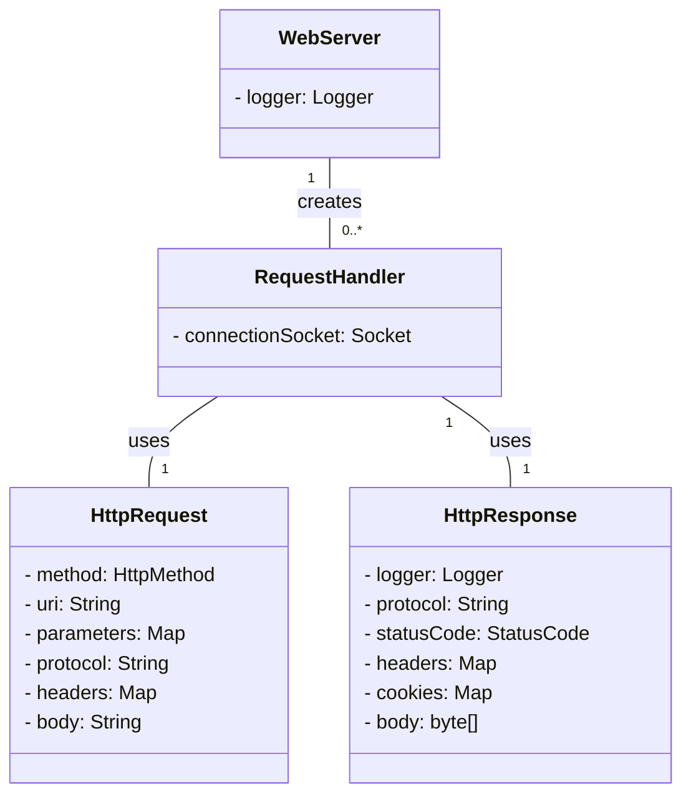

# be-was-2025
코드스쿼드 백엔드 교육용 WAS 2025 개정판

# 학습 기록
[level 1](https://github.com/softeer5th/backend-page/wiki/%ED%95%9C%EC%A4%80%ED%98%B8_week1_day1)

# 학습해야 하는 내용
- LogBack
- HTTP 파싱

# 구현해야 하는 것
- HTTP 파싱
- ExecutorService 사용하도록 변경

# 도메인 모델
